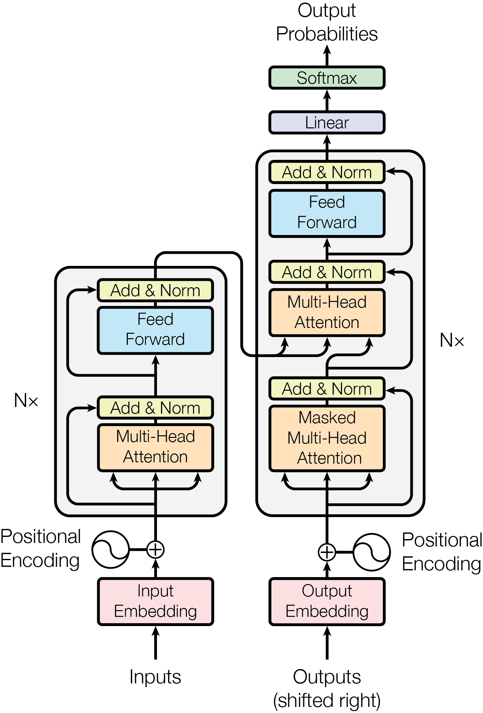

# NLP

## 基础知识

[通俗理解word2vec](<https://www.jianshu.com/p/471d9bfbd72f> )

[cs224n学习笔记(2)CBOW与Skip-Gram模型](<https://zhuanlan.zhihu.com/p/47585825> )

[从Word Embedding到Bert模型](https://zhuanlan.zhihu.com/p/49271699)

[CS224n-notes-and-codes](https://github.com/beyondguo/CS224n-notes-and-codes)

## 词向量

### word2vec

- skip-gram 
- CBOW 在窗口内预测中间词

### FastText

类似于CBOW，预测标签

softmax 归一化处理 较耗时    --> 分层的softmax 根据类别的频率构造霍夫曼树

n-gram 字粒度和词粒度

## RNN

### N-gram

不必回溯一个词的全部历史，可以近似地认为，一个词的出现概率只与它前面有限的 n−1 个词有关，如图3.1所示。基于这个假设建立的语言模型，我们称之为 **N-gram模型**。在大型语料库中进行**最大似然估计(Maximum Likelihood Estimation,MLE)** 来计算

N-gram 模型虽然简单有效，但有两个致命缺陷：

1. **数据稀疏性 (Sparsity)** ：如果一个词序列从未在语料库中出现，其概率估计就为 0，这显然是不合理的。虽然可以通过平滑 (Smoothing) 技术缓解，但无法根除。
2. **泛化能力差：**模型无法理解词与词之间的语义相似性。例如，即使模型在语料库中见过很多次 `agent learns`，它也无法将这个知识泛化到语义相似的词上。当我们计算 `robot learns` 的概率时，如果 `robot` 这个词从未出现过，或者 `robot learns` 这个组合从未出现过，模型计算出的概率也会是零。模型无法理解 `agent` 和 `robot` 在语义上的相似性。

### RNN

**循环神经网络 (Recurrent Neural Network, RNN)** 应运而生，其核心思想非常直观：为网络增加“记忆”能力。RNN 的设计引入了一个**隐藏状态 (hidden state)** 向量，我们可以将其理解为网络的短期记忆。在处理序列的每一步，网络都会读取当前的输入词，并结合它上一刻的记忆（即上一个时间步的隐藏状态），然后生成一个新的记忆（即当前时间步的隐藏状态）传递给下一刻。这个循环往复的过程，使得信息可以在序列中不断向后传递。

标准的 RNN 在实践中存在一个严重的问题：**长期依赖问题 (Long-term Dependency Problem)** 。在训练过程中，模型需要通过反向传播算法根据输出端的误差来调整网络深处的权重。对于 RNN 而言，序列的长度就是网络的深度。当序列很长时，梯度在从后向前传播的过程中会经过多次连乘，这会导致梯度值快速趋向于零（**梯度消失**）或变得极大（**梯度爆炸**）。梯度消失使得模型无法有效学习到序列早期信息对后期输出的影响，即难以捕捉长距离的依赖关系。

RNN串行计算”的模式有两个致命问题：

1. **并行性差**：无法同时处理多个词，训练速度极慢，面对长句子（如段落、文章）时效率更低；
2. **长距离依赖难捕捉**：当句子过长时，早期词的信息会逐渐“遗忘”，比如翻译“小明昨天买的那本书，今天被他弄丢了”时，RNN很难将“他”和“小明”精准关联。

### LSTM

为了解决长期依赖问题，**长短时记忆网络 (Long Short-Term Memory, LSTM)** 被设计出来。

LSTM 是一种特殊的 RNN，其核心创新在于引入了**细胞状态 (Cell State)** 和一套精密的**门控机制 (Gating Mechanism)** 。细胞状态可以看作是一条独立于隐藏状态的信息通路，允许信息在时间步之间更顺畅地传递。门控机制则是由几个小型神经网络构成，它们可以学习如何有选择地让信息通过，从而控制细胞状态中信息的增加与移除。这些门包括：

- **遗忘门 (Forget Gate)**：决定从上一时刻的细胞状态中丢弃哪些信息。
- **输入门 (Input Gate)**：决定将当前输入中的哪些新信息存入细胞状态。
- **输出门 (Output Gate)**：决定根据当前的细胞状态，输出哪些信息到隐藏状态。

## Transformer

[从零解读碾压循环神经网络的transformer模型(一)-注意力机制](https://www.bilibili.com/video/av58239477/?spm_id_from=333.788.b_636f6d6d656e74.4) 很好的讲解视频，[文档](https://github.com/aespresso/a_journey_into_math_of_ml)也较全面

[The Illustrated Transformer](https://jalammar.github.io/illustrated-transformer/) 较为优秀的blog，国内大多数博客抄的这篇，但感觉流程逻辑较分散

[google官方解读](https://research.google/blog/transformer-a-novel-neural-network-architecture-for-language-understanding/?m=1)

[Attention Is All you Need](<https://senliuy.gitbook.io/advanced-deep-learning/di-er-zhang-ff1a-xu-lie-mo-xing/attention-is-all-you-need> )

[可视化transformer](https://poloclub.github.io/transformer-explainer/)



#### 解码器堆栈 (Transformer Decoder Stack)

https://zhuanlan.zhihu.com/p/1931005377689944240

https://github.com/datawhalechina/hello-agents/blob/main/docs/chapter3/%E7%AC%AC%E4%B8%89%E7%AB%A0%20%E5%A4%A7%E8%AF%AD%E8%A8%80%E6%A8%A1%E5%9E%8B%E5%9F%BA%E7%A1%80.md

- **遮蔽多头自注意力 (Masked Multi-Head Self-Attention):**

  - **遮蔽 (Masked/Causal Mask):** 这是 GPT-1 作为**自回归模型**的关键。在计算注意力时，一个**因果掩码**会被应用，确保模型在预测当前词时，**只能看到它前面的词，而不能“偷看”后面的词**。

  - **多头 (Multi-Head):** 意味着模型并行地执行**多个独立的自注意力计算**。每个“头”学习不同的注意力模式，捕捉不同的关系。例如，一个头可能关注语法依赖，另一个可能关注语义关联。这种并行性提高了模型的表达能力。

  - **自注意力 (Self-Attention):** 允许模型在处理序列中的一个词时，同时关注序列中的**所有其他词**。它计算每个词对序列中所有其他词的“重要性”或“相关性”分数。

- **层归一化 (Layer Normalization):** 在每个子层（自注意力层和前馈网络层）的输入之前和之后都会应用层归一化。这有助于稳定训练过程，并加速收敛。

- **前馈神经网络 (Feed-Forward Network):** 每个注意力子层的输出会进一步通过一个位置共享（即对序列中每个位置应用相同的网络）的**两层全连接神经网络**。这增加了模型的非线性表达能力，允许它学习更复杂的特征。

- **残差连接 (Residual Connections):** 每个子层（自注意力层和前馈网络层）都使用了残差连接，即<u>子层的输入会直接加到其输出上</u>。这有助于缓解深度网络的梯度消失问题，使模型能够更深地训练。


#### 自注意力


公式


**为什么要除以 根号d？** 

1. 防止梯度消失
2. 为了让 QK 的内积分布保持和输入一样

**注意力机制和自注意力的区别**

注意力关注其他内容的重要部分，自注意力关注自身，例如做文本对应


**Transformer相较传统RNN的优势**

- 并行计算
  - RNN循环依赖上一步输出，无法并行处理序列。
  - 而Transformer的自注意力机制对序列中每个位置同时计算与其他位置的相关性，没有时序依赖，可以用矩阵运算并行处理整句话 。
  - 这使得训练时GPU利用率高，能够在海量数据上训练非常深的模型。
- 长程依赖捕获
  - 注意力机制可以让每个词直接“看”其他所有词，不管距离多远都在一次注意力计算中体现。
  - 而RNN要经过许多步状态传递才能把远处信息带过来，中间可能梯度消失或信息淡化。
- 更好的表示能力
  - 多头注意力提供了对不同关系特征的建模能力，且注意力是输入内容自适应的，加上FFN的非线性变换，整个模型具有极强表达力。
  - RNN虽然也可以堆叠层和门控，但Transformer因为摆脱了序列顺序计算限制，可以更自由地增加层数和宽度（维度），加上FeedForward层提供丰富特征组合，因而更易扩展出超高参数模型。
- 训练稳定性
  - Transformer用了注意力+残差+正则化，使其训练较稳定。
  - 某些RNN需要小心初始化和梯度剪裁，以避免梯度消失和爆炸问题。
    - **梯度爆炸（gradient explosion）**：训练刚开始，Loss 一下子飙升为无穷大；
    - **梯度消失（gradient vanishing）**：Loss 长期不下降，模型几乎不学习。

## BERT

[源代码](https://github.com/google-research/bert)

[一文读懂BERT(原理篇)](https://blog.csdn.net/jiaowoshouzi/article/details/89073944) 很棒的一篇博客

[词向量之BERT](<https://zhuanlan.zhihu.com/p/48612853> )

[Bert在NLP各领域的应用进展](https://zhuanlan.zhihu.com/p/68446772) 一个很好的展望，新颖深入理性幽默，是我喜欢的博主风格hh

输入：[CLS] 映射为NSP二分类任务、[SEP] 分句

预训练任务：MLM+NSP


## GPT

[gpt原理](https://zhuanlan.zhihu.com/p/1931005377689944240)


## LLM

[手写 transformer decoder（CausalLM）](https://yuanchaofa.com/hands-on-code/hands-on-causallm-decoder)

[手写 Self-Attention 的四重境界，从 self-attention 到 multi-head self-attention](https://yuanchaofa.com/hands-on-code/from-self-attention-to-multi-head-self-attention)


### 术语清单

| 模块           | 英文                                             | 中文                                                         |
| -------------- | ------------------------------------------------ | ------------------------------------------------------------ |
| LLM 的定义     | Large Language Models (LLM)                      | 大语言模型                                                   |
|                | Natural Language Processing (NLP)                | 自然语言处理                                                 |
|                | Machine Learning (ML)                            | 机器学习                                                     |
| LLM 的类型     | Autoencoder–Based Model                          | 自编码器模型（如BERT）， GPT 模型中，无监督预训练主要采用自回归语言建模<br />因果语言模型（Causal Language Model），也被称为自回归语言模型（Autoregressive Language Model） |
|                | Sequence–to–Sequence Model                       | 序列到序列模型                                               |
|                | Transformer–Based Frameworks                     | Transformer框架                                              |
|                | Recursive Neural Networks                        | 递归神经网络                                                 |
|                | Hierarchical Structures                          | 分层结构                                                     |
| LLM 的关键组件 | Architecture                                     | 架构                                                         |
|                | Pre–training                                     | 预训练                                                       |
|                | Fine–tuning                                      | 微调                                                         |
| LLM 的训练过程 | Data Collection and Pre–processing               | 数据收集与预处理                                             |
|                | Model Selection and Configuration                | 模型选择与配置                                               |
|                | Model Training                                   | 模型训练                                                     |
|                | Evaluation and Fine–Tuning                       | 评估与微调                                                   |
|                | Parameter-Efficient Fine-tuning, PEFT            | 参数高效微调<br />LoRA (Low-Rank Adaptation)<br />人类对齐（RLHF/DPO） |
|                | RLHF: Reinforcement Learning from Human Feedback |                                                              |
| LLM 的工作原理 | Tokenization                                     | 分词                                                         |
|                | Embedding                                        | 嵌入                                                         |
|                | Attention                                        | 注意力机制                                                   |
|                | Pre–training                                     | 预训练                                                       |
|                | Transfer Learning                                | 迁移学习                                                     |
| LLM 的应用案例 | Chatbots and Virtual Assistants                  | 聊天机器人和虚拟助手                                         |
|                | Sentiment Analysis                               | 情感分析                                                     |
|                | Text Summarization                               | 文本摘要                                                     |
|                | Machine Translation                              | 机器翻译                                                     |
|                | Content Generation                               | 内容生成                                                     |
|                | Code Completion                                  | 代码补全                                                     |
|                | Language Translation                             | 语言翻译                                                     |
|                | Data Analysis                                    | 数据分析                                                     |
|                | Education                                        | 教育                                                         |
|                | Medical Applications                             | 医疗应用                                                     |
|                | Market Research                                  | 市场研究                                                     |
|                | Entertainment                                    | 娱乐                                                         |
| 未来趋势和挑战 | Contextual Understanding                         | 提高上下文理解能力                                           |
|                | Ethical and Bias Mitigation                      | 伦理和偏见缓解                                               |
|                | Continual Learning and Adaptation                | 持续学习和适应                                               |


### Types of Large Language Models

#### Autoencoder-Based Model

One type of large language model is the autoencoder-based model, which works by encoding input text into a lower-dimensional representation and then generating new text based on that representation. This type of model is especially good for tasks like summarizing text or generating content.

#### Sequence-to-Sequence Model

Another type of large language model is the sequence-to-sequence model, which takes an input sequence (like a sentence) and generates an output sequence (like a translation into another language). These models are often used for machine translation and text summarization.

#### Transformer-Based Models

Transformer-based models are another popular type of large language model. These models use a neural network architecture that's great at understanding long-range dependencies in text data, making them useful for a wide range of language tasks, including generating text, translating languages, and answering questions.

#### Recursive Neural Network Models

Recursive neural network models are designed to handle structured data like parse trees, which represent the syntactic structure of a sentence. These models are useful for tasks like sentiment analysis and natural language inference.

#### Hierarchical Models

Finally, hierarchical models are designed to handle text at different levels of granularity, such as sentences, paragraphs, and documents. These models are used for tasks like document classification and topic modeling.

### Types of LLM Architectures

Not all Transformers are built for the same purpose. Here are simple breakdown:

#### 1. Encoder Only Models (BERT, RoBERTa)

Trained to *understand* text by predicting masked words.
Used for:

- Sentiment analysis
- Entity recognition
- Search ranking

Think of BERT as the *reader* of the AI world.

#### 2. Decoder-Only Models (GPT, LLaMA, Mistral)

Trained to *generate* the next word given the previous ones.
Used for:

- Chatbots (ChatGPT, Claude)
- Story and code generation
- Creative writing

GPT models are the *writers* of the AI world.

#### 3. Encoder–Decoder Models (T5, BART, FLAN-T5)

Trained for *transformation tasks* meaning one sequence into another.
Used for:

- Summarization
- Translation
- Question answering

These are the *translators* of AI

## 实战

[The Complete Guide to Large Language Models: From Basics to Production](https://medium.com/@vkgcloud7/the-complete-guide-to-large-language-models-from-basics-to-production-2025-edition-1d48579ace10) 

### Fine-Tuning: Teaching LLMs New Tricks

Pretrained models know a lot but not everything. Fine-tuning tailors them to specific tasks or domains.

#### 1. Task-Specific Fine-Tuning

You take a pretrained model and train it on a domain dataset say, **legal contracts** or **medical notes**.

```
from transformers import AutoModelForSequenceClassification, Trainer, TrainingArguments

model = AutoModelForSequenceClassification.from_pretrained("bert-base-uncased", num_labels=2)
training_args = TrainingArguments(output_dir="./results", num_train_epochs=3)
trainer = Trainer(model=model, args=training_args, train_dataset=my_dataset)
trainer.train()
```

**Trade-offs:**
Domain expertise improves and Risk of losing general capabilities (catastrophic forgetting)

#### 2. Parameter-Efficient Fine-Tuning (PEFT / LoRA)

Fine-tuning large models is expensive. Enter **LoRA (Low-Rank Adaptation)** which is a way to train small adapters instead of updating the entire model. **LoRA（Low-Rank Adaptation，低秩适配）\**是大模型的\**参数高效微调方法**，冻结预训练主体权重，只训练少量低秩矩阵，用极低成本实现领域适配。

```
from peft import LoraConfig, get_peft_model
from transformers import AutoModelForCausalLM
model = AutoModelForCausalLM.from_pretrained("meta-llama/Llama-2-7b")
lora_config = LoraConfig(r=8, lora_alpha=32, target_modules=["q_proj","v_proj"])
model = get_peft_model(model, lora_config)
```

**LoRA fine-tuning** can be done on a **single GPU with 20% memory** use, making customisation affordable.


### 模型训练

FP16：1B （1亿）参数 ≈ 2GB 显存

10B模型需要20GB训练

1）推理场景（只跑不训练）

**34B FP16** 举例：80GB A100 刚好**塞满**

- 模型权重：68GB
- **KV 缓存**（对话生成长度越长，吃显存越猛）**中间激活值、梯度、优化器参数**（训练时爆炸）

2）训练场景（更吃显存）

训练时还要存：

- 梯度
- 优化器动量
- 中间激活值

开销是**模型权重的好几倍**，80GB 训练只能稳稳驾驭 **7B、13B**

### LLMs in Action

LLMs are not just chatbots they are **reasoning engines**, **retrievers** and **agents**.

#### 1. Retrieval-Augmented Generation (RAG)

Combines LLMs with external knowledge bases (like vector DBs).

```
from langchain.chains import RetrievalQA
from langchain.llms import OpenAI
qa = RetrievalQA.from_chain_type(llm=OpenAI(), retriever=my_vector_store.as_retriever())
qa.run("Summarise my product feedback reports")
```

Advantages:

- Uses *up-to-date* data without retraining
- Reduces hallucinations
- Enables enterprise/private data integration

#### 2. Chain-of-Thought Prompting (CoT)

Encourages reasoning by “*thinking step-by-step*”

Example prompt: *“Let us think this through step by step…”*

Leads to clearer, more accurate reasoning (used in Gemini and GPT-4).

#### 3. Program Aided Language (PAL)

For tasks requiring exact answers, let the LLM write and execute code. Electric Vehicle Range (Relevant to Connected Vehicle/Fleet context) ***Example: Estimate EV driving range\***

```
# Example: Estimate EV driving range
battery_capacity_kwh = 45
efficiency_km_per_kwh = 7.5
range_km = battery_capacity_kwh * efficiency_km_per_kwh
print(range_km)  # 337.5
```

#### 4. ReAct (Reason + Act)

The model alternates between reasoning and tool use (search, code, database query).

Example:

- *Thought:* I need current weather data
- *Action:* Call weather API
- *Observation:* “Rainy, 23°C”
- *Thought:* Respond appropriately

ReAct powers modern **agentic AI** systems, the foundation for LLM-based assistants that plan, act and learn autonomously.

### Deploying and Optimizing LLMs

Once fine-tuned, how do we deploy efficiently?

### Distillation

Train a smaller “student” model to mimic a large “teacher”

Benefits
Retains most performance
Great for edge or embedded use
Requires high-quality teacher outputs

### Pruning & Quantization

Remove low-impact weights and reduce precision.

2–4× smaller models
Faster inference
Negligible accuracy loss

### Evaluating LLMs: What “Good” Looks Like

Metrics and benchmarks measure comprehension, coherence and reasoning:

Press enter or click to view image in full size


## The Future of LLMs (2025 and Beyond)

What’s next for LLMs?
Three trends are redefining the field:

1. **Multimodal Models:** GPT-4o, Gemini and Claude 3 now handle text, images and audio seamlessly.
2. **Agentic AI Systems:** LLMs that plan, act and reason over multiple steps autonomously.
3. **Smaller Yet Smarter Models:** Open-weight models like Mistral 7B and Phi-3-mini show that efficiency > sheer scale.

Soon, personalised LLMs, fine-tuned on your data and preferences, will power every app, workspace and interaction.
