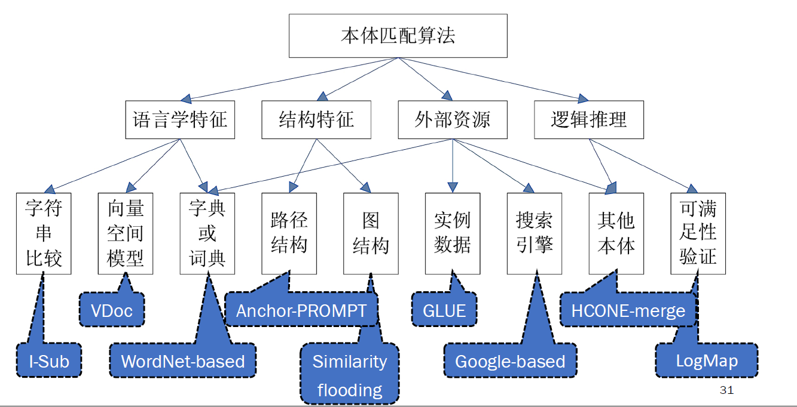
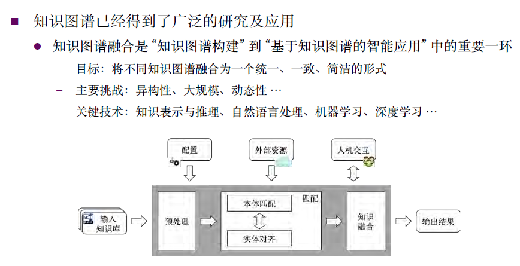
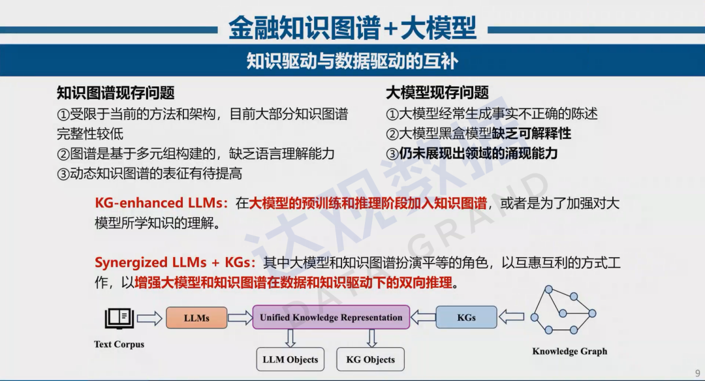

# 知识图谱

http://pelhans.com/ 作者已经写的很全了，就不再造轮子了

[概览](http://pelhans.com/2018/03/15/xiaoxiangkg-note1/)

[知识表示与知识建模](http://pelhans.com/2018/03/16/xiaoxiangkg-note2/)

[知识抽取](http://pelhans.com/2018/03/19/xiaoxiangkg-note3/)

[知识挖掘](http://pelhans.com/2018/04/19/xiaoxiangkg-note4/)

[知识存储](http://pelhans.com/2018/04/20/xiaoxiangkg-note5/)

[知识推理](http://pelhans.com/2018/04/24/xiaoxiangkg-note7/)

[语义搜索](http://pelhans.com/2018/04/27/xiaoxiangkg-note8/)

[知识问答](http://pelhans.com/2018/04/28/xiaoxiangkg-note9/)

## [知识图谱融合](http://pelhans.com/2018/04/24/xiaoxiangkg-note6/)

==核心内容，非完善版==

参考 

- http://pelhans.com/tags/#Knowledge%20Graph
- https://github.com/nju-websoft/KnowledgeGraphFusion.git

### 1.  基础知识

输入：多个RDF/OWL格式的知识图谱

预处理：清洗和后续步骤的准备，包括：语法正规化，数据正规化

**方法分类**

- 匹配所用特征
- 知识融合机制
- 方法适用范围

### 2. 本体匹配

### 3. 实体对齐

发现指称真实世界相同对象的不同实例

#### 3.1 传统实体对齐方法

- 等价关系推理

- 相似度计算
  
  ​    成对实体对齐
  
  ​    集体实体对齐
  
  ​    大规模集体实体对齐

- 混合方法

#### 3.2  基于 embedding的方法

   基于翻译模型的方法

   基于图神经网络的方法

### 4.  知识融合

#### 4.1 无监督模型

- 迭代模型
- 优化模型
- 概率图模型

无监督模型利用数据冲突和数据源质量估计

有监督模型利用特定领域特征和少量标记数据

#### 4.2 半监督模型

### 5.  总结

## 多模态知识图谱数据库

[Answering Visual-Relational Queries in
Web-Extracted Knowledge Graphs 数据集](https://github.com/mniepert/mmkb)

    

[M5Product: Self-harmonized Contrastive
Learning for E-commercial Multi-modal Pretraining数据集](https://xiaodongsuper.github.io/M5Product_dataset/index.html)

The M5Product dataset is a large-scale multi-modal pre-training dataset with coarse and fine-grained annotations for E-products.

**• 6 Million** multi-modal samples, **5k** properties with **24 Million** values

**• 5** modalities-**image** **text** **table** **video** **audio**

**• 6 Million** category annotations with **6k** classes

**•** Wide data source (**1 Million** merchants provide)

金融数据底座的构建可以包括各类金融实时数据，各类需解析的文档数据、各类非结构化数据以及信息高度浓缩文本。通过庞大的金融垂直类数据为金融大模型提供数据支撑。

①各类金实时数据：股票、债券、基金、衍生品、指数等
②各类需解析的文档数据：银行流水、财报、年报、ESG报告等
③各类非结构化数据：金融新闻、法律、研报、公司信息、银行内外规等
④信息高度浓缩文本：金融教材、百科等

对于金融垂直领域大模型的构造需要解决的关键问题有如下三点：

01
多源、异构金融数据金融数字底座构建、金融数据安全共享使用。

02
金融数据底座与大模型的融合技术，解决通用大模型在垂直领域知识匮乏、知识关联问题，同时实现模型根据数据实时更新、不断迭代。

03
基于金融科技底座的大模型对于金融科技多领域的应用赋能，展现金融垂直领域涌现能力。

ref:https://mp.weixin.qq.com/s/s3GcuubjRdPnusR7vVe5hg 中国工程院院士、复旦大学金融科技研究院院长柴洪峰《大模型赋能金融科技思考与展望》

Fusion of Relational and Graph Database Techniques: An Emerging Trend

DASFAA 2023 Tutorial

[关系数据库和图数据库关键技术融合趋势](https://mp.weixin.qq.com/s?__biz=MzI0MDMzOTU5MQ==&mid=2247497112&idx=1&sn=7a174b00c8a9ae98bc4bbcd311ff9cda&chksm=e91eea70de69636612db941d33439e85f8386bc7b7e9553f0d7790034aa19e0a8cda5b07cb8e&mpshare=1&scene=1&srcid=0804aoR7XZz3eGtNEhpbKIFb&sharer_sharetime=1691126895335&sharer_shareid=87cc67615262f602098cdd516be6c8de&key=839525186d511ea6bc06326e061cf55cdaf530fe924d17833854063e8c6b844e93a6090bf295cec6311606b71d2fd4550b3a187d697818a8b10ac7a6f24c21d9e940b8b96447e6a2edd175762a447402639f0ca2d6d6415db7f8582e38552a8752af361f356a5411906f3b31659dd42bc539ff698868c059327eaaf2240df485&ascene=1&uin=NTUxNzI0OTg4&devicetype=Windows-QQBrowser&version=6103000b&lang=zh_CN&countrycode=CN&exportkey=n_ChQIAhIQrhNHtxitPCK5jvY5zOAs3hLjAQIE97dBBAEAAAAAACMODWpC5KAAAAAOpnltbLcz9gKNyK89dVj0HmJxxP%2BECrsoBcZdBFbBNgX2WfeSXpZvIbmZHhRs7g3jvTz2cvC%2BBS595prvruDS0Jm5IKV6n4TmQ6FnnN0htvIBXqgT2dhiExo39ul4sbLgWkdjTf2e9uG0m%2Bsas0O4nsqxT7PmVcKHC3N4kgiAcmpRY3uxrxeJ4rrw%2FFHhFXkpWTzTGgOkhttUW%2Fx3MRYUocjpfVMRoPOZtXU6y%2BN80zMZ2pVLPSPeRm9KeNHWBY0VELbnm9pt6gsLJIVs&acctmode=0&pass_ticket=ze5pmWOyeSZsB6LdJeZ2Sqxf1DNkK2rvqlAOUohUR%2FG2%2BoYT9eL3Lfnl7XDutS6X&wx_header=0)
