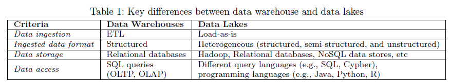
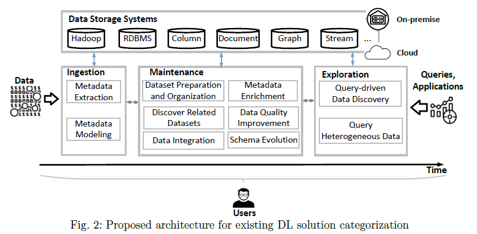
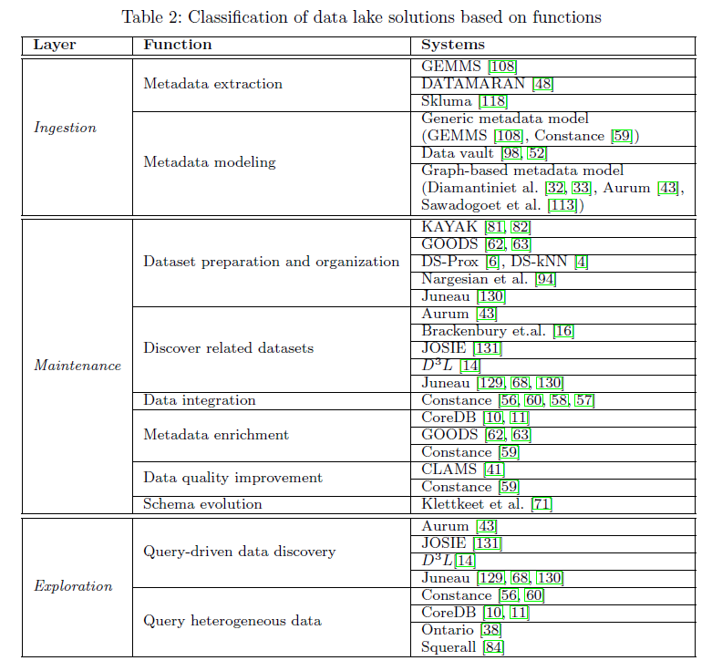
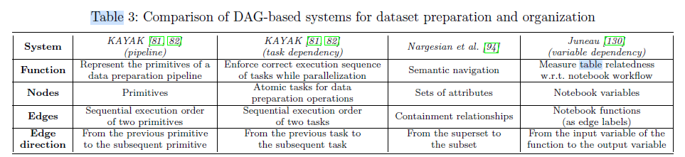
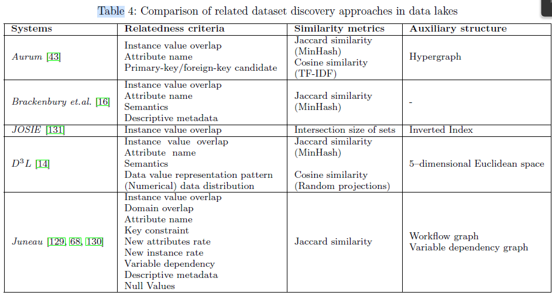
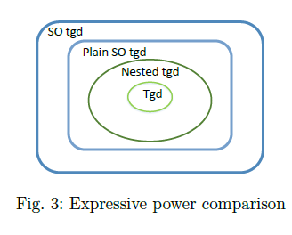
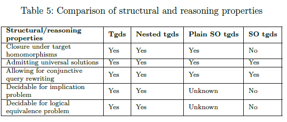

# Data lake concept and systems: a survey

## Abstract

- reviews the development, definition, and architectures of data lakes

- provide a comprehensive overview of research questions for designing and building data lakes

- classify the existing data lake systems based on their provided functions

## 1 Introduction

Big data -> ELT, NoSQL -> data lakes

## 2 A brief history of data lakes

- 2010-2013: Beginnings
- 2014-2015: Criticisms and further development
- 2016-present: Prosperity and diversity

## 3 Data lake definition

**Data Lake**: A data lake is a  flexible, scalable data storage and management system, which ingests and stores raw data from heterogeneous sources in their original format, and provides query processing and data analytics in an on-the-fly manner.

**remarks**

- store raw data
- not only a storage system
- support on-demand data processing and querying

## 4 Data lake architecture

**two high-level data lake philosophies**:

- pond architecture
- zone architecture

High-level architectural philosophies lack technical details about functions, which hampers modular and repeatable implementations

**users**

- data scientists
- information curators
- the governance, risk, and compliance team
- operations team

## 5 Storage

preserve the ingested datasets

### 5.1 File-based storage systems

e.g. HDFS: supports a wide range of files

### 5.2 Single data store

e.g. Neo4j

has a special application focus on user data of usually relatively small size compared to business scenarios, but higher requirements regarding data privacy

### 5.3 Polystore systems

e.g. BigDAWG

### 5.4 Data lakes on clouds

e.g. IaaS

- scale the storage space and computation power dynamically, and in many cases the prices of resources are more economic than on-premises
- the major cloud vendors provide many additional analytics tools in their product portfolio
- relying on a cloud platform also implies risks and challenges in some aspects such as data security, data provenance, and fault tolerance

## 6 Ingestion

Ingestion components load data into the lake, and store data into databases or file systems

### 6.1 Metadata extraction

**To** discovers metadata information that is essential for accessing a dataset

e.g. GEMMS, DATAMARAN, Skluma

### 6.2 Metadata modeling

**To** structure and organize the metadata in a formal way

The majority of such models are either logic-based or graph-structured with more or less formal semantics

- Generic metadata model

- Data vault

- Graph-based metadata model
  
  e.g. Aurum

## 7 Maintenance

**To** make the data usable the data lake needs to further process and maintain the raw data

### 7.1 Dataset preparation and organization

structure and navigate the massive heterogeneous datasets in data lakes

#### 7.1.1 Dataset preparation

e.g. KAYAK

#### 7.1.2 Data lake organization

e.g. GOODS, DS-kNN

**data lake organization problem**: discovering the optimal structure for users to electively nd the desired dataset in a data lake

### 7.2 Discover related datasets

**data discovery**: tries to find a subset of relevant datasets that are similar or complementary to a given dataset in a certain way

**step** 

1. define and extract relatedness signals from tables
2. compute multi-dimensional similarities between attributes,  and aggregate them to an overall similarity between tabular datasets

### 7.3 Data integration

**To** combining multiple heterogeneous data sources and providing unified data access for users

data integration techniques: schema matching, schema mapping, query reformulation, entity linkage

e.g. Constance

### 7.4 Metadata enrichment

**To** further understand and explore a dataset

e.g. CoreDB, GOODS, Constance

### 7.5 Data quality improvement

obtain dependencies from the data in the data lakes, and then use them to improve the data quality.

e.g. CLAMS, Constance

### 7.6 Schema evolution

handling the changes of schemas and integrity constraints

## 8 Exploration

challenging: 

- a large number of ingested sources
- the heterogeneity of data

solutions:

- discover the data lakes based on the relatedness of datasets
- provide a unified query interface for heterogeneous data sources

### 8.1 Query-driven data discovery

searching a data lake based on the measured relatedness (e.g., joinable, unionable) among datasets

### 8.2 Query heterogeneous data

e.g. Constance, CoreDB, Ontario

querying solutions:

- transform the data in heterogeneous NoSQL stores into relational tables and uses an existing relational database to process the data. e.g. Argo
- multistore systems providing a SQL-like query language to query NoSQL systems
- applying a middle-ware to access the multiple NoSQL stores

## 9 Composite metadata management

**To** prevent a data lake turn into a "data swamp"

### 9.1 Schema mapping formalisms

algorithmic properties (computational eficiency)

metadata-related challenges:

- Expressive power

- Structural properties and decidability of reasoning tasks

### 9.2 Data provenance(data lineage)

the information of data records

## 10 New directions

- Machine learning in data lakes
- Data lakes for data science
- Stream data lakes

## 11 Summary and outlook

Some well-studied problems (e.g., data integration, schema evolution, metadata modeling) need new perspectives and methods in data lakes; while many blank spaces (e.g., stream data lakes, integrate data lakes with machine learning and data science) also call for novel solutions.
