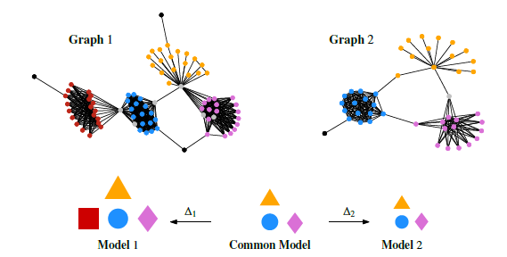
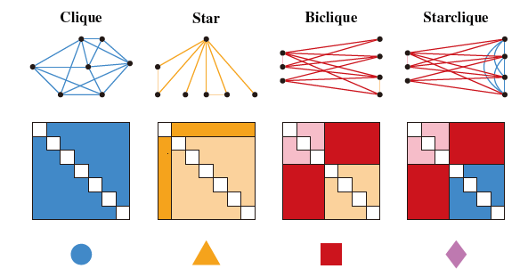
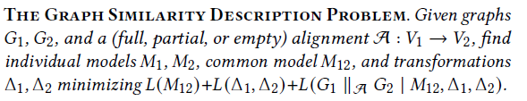
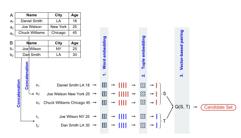
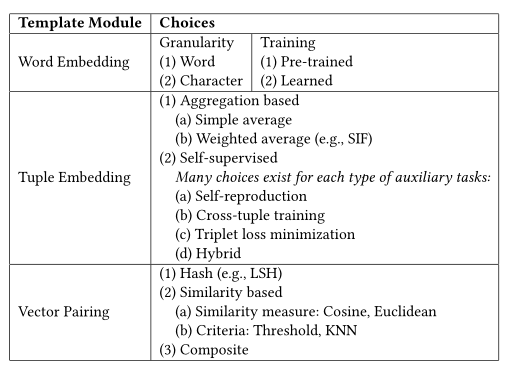
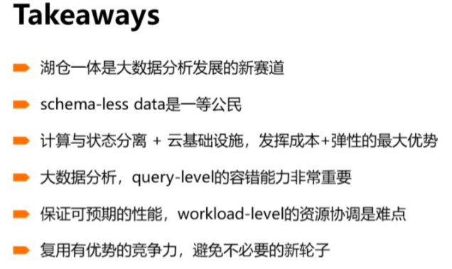

# 论文阅读笔记

我姑且把论文的阅读方式分为四种：精读3、通读2、略读1、不读，目前结合自己的情况，通读略读的论文放在这里，为了留下一个印象，同时为以后的工作提供参考。精读的论文批注本来是储存在文档上了，但后来发现当自己需要回顾的时候，不能一个一个打开文档，而且自己鸡的记忆，所以还是放在这里供后期回顾总结。

本目录以方向分类，以发表时间为序。

## 目录

[图](#图)

[数据](#数据)

[图神经网络](#图神经网络)

[知识图谱](./2021-09-14-论文阅读笔记)

[信息系统](信息系统)

[分布式](#分布式)

## 内容

### <a id="图">图</a>

```
Learning Graph Representations with Embedding Propagation
```

https://zhuanlan.zhihu.com/p/36027021

Forward messages  Backward messages

与Message Passing Neural Network (MPNN) 的不同：

- unsupervised
- combines label embeddings into a joint node
- reconstructing each node’s representation from neighboring nodes’ representations 

首先将节点v 的邻居节点的属性向量表达结合起来，重建出节点v 的属性向量表达；接着，将节点 v 本身的属性向量与重建出来的属性向量的差值的梯度，反向传播给它的邻居，来更新邻居的属性向量，不断迭代，直至收敛（或迭代一定次数)。

```
@article{coupette2021graph,
  title={Graph Similarity Description: How Are These Graphs Similar?},
  author={Coupette, Corinna and Vreeken, Jilles},
  journal={arXiv preprint arXiv:2105.14364},
  year={2021}
}
-2
```

**主要内容：**

​    MOMO采用联合压缩图，比较图的相似性程度

​    BEPPO为单个输入图发现可解释的摘要，GIGI使用它们来揭示它们共享的和特定的结构，从中计算信息相似度得分

**理论：**

   

1. 非正式相似度描述
   
   论文将图简化为四种基本结构（cliques、Stars、Bicliques、Starcliques），通过邻接矩阵，将节点集大小作为节点得分，连通性约束为边密度。
   
   

2. 编码
   
   - Graph Under an Individual Model
   - Individual Model
   - Common Model
   - Transformations

3. 度量
   
   Normalized Model Distance
   
   $$
   \operatorname{NMD}\left(G_{1}, G_{2}\right)=\frac{L\left(M_{12}\right)+L\left(\Delta_{1}, \Delta_{2}\right)-\min \left\{L\left(M_{1}\right), L\left(M_{2}\right)\right\}}{\max \left\{L\left(M_{1}\right), L\left(M_{2}\right)\right\}}
   $$

4. 正式
   
   ​    

**算法：**

- 图摘要：BEPPO，算法1
  
  全图查找高度节点，构建基本结构

- 模型配准：GIGI，算法2
  
  查找公共结构和独特的结构

**相关工作**

​    图相似性度量，图摘要

**Tips：**

​    data, code, and results均可[获得]( https://zenodo.org/record/4780912#.YUCSorgzZPY)

### <a id="数据">数据</a>

```
Deep Learning for Blocking in Entity Matching: A Design Space Exploration
-2
```

表匹配





```
High-Dimensional Similarity Query Processing for Data Science
-2
```

(1) data models and the way of which we convert raw data (text, images, video, etc.) to high-dimensional data; 

(2) similarity/distance functions, mainly Hamming distance for binary vectors and Euclidean distance and cosine similarity (angular distance) for real-valued vectors; 

(3) query types, i.e., search and join queries, or thresholded and top-𝑘 (𝑘-NN) queries, depending on the dimension of categorization;

1. Locality Sensitive Hashing

2. Learning to Hash.

3. Partition-based Methods

4. Neighborhood-based Methods.

   1. 𝑘-NN graph [5], 

   	2. hierarchical navigable small world [14],
   	2. navigating spreading-out graph [6].

https://www.sklearncn.cn/7/#161


### <a id="图神经网络">图神经网络</a>

```
@article{wu2020comprehensive,
  title={A comprehensive survey on graph neural networks},
  author={Wu, Zonghan and Pan, Shirui and Chen, Fengwen and Long, Guodong and Zhang, Chengqi and Philip, S Yu},
  journal={IEEE transactions on neural networks and learning systems},
  volume={32},
  number={1},
  pages={4--24},
  year={2020},
  publisher={IEEE}
}
-survey
-2
```

[参考文章](https://zhuanlan.zhihu.com/p/75307407?utm_source=wechat_session&utm_medium=social&utm_oi=1070349627613564928&utm_campaign=shareopn)

Graph neural networks vs. network embedding

network embedding：用低维向量表示网络节点，既保留网络拓扑结构又保留节点内容信息

GNN ：旨在以端到端方式处理图相关任务的深度学习模型

GNN可以通过一个图形自动编码器框架来解决网络嵌入问题。另一方面，网络嵌入还包含其他非深度学习方法，如矩阵分解和随机游动等

传统深度学习方法不适用于图的原因：

- 图是不规则的
- 图数据之间有关联

图神经网络：

1. 图卷积网络（Graph Convolution Networks，GCN）
   
   - 基于谱（spectral-based）：缺点：需要将整个图加载到内存中以执行图卷积
   - 基于空间（spatial-based）

2. 图注意力网络（Graph Attention Networks）
   
   - Graph Attention Network (GAT)    优点：自适应地学习邻居的重要性权重
   
   - Gated Attention Network (GAAN)   优点：自适应地学习邻居的重要性权重
   
   - Graph Attention Model (GAM)

3. 图自编码器（ Graph Autoencoders）

4. 图生成网络（ Graph Generative Networks）
   
   - 基于GCN
     
     - Molecular Generative Adversarial Networks (MolGAN)
     - Deep Generative Models of Graphs (DGMG)
   
   - other
     
     - GraphRNN
     
     - NetGAN

5. 图时空网络（Graph Spatial-temporal Networks）

```
Heterogeneous Graph Attention Network
```

然而，对于包含不同类型节点和链接的异构图，它在图神经网络中并没有得到充分的考虑。异构性和丰富的语义信息给异构图神经网络的设计带来了巨大的挑战。

现实世界中的图形通常具有多种类型的节点和边，也称为异构信息网络（HIN）

### <a id="信息系统">信息系统</a>

```
@inproceedings{lian2018high,
  title={High-order proximity preserving information network hashing},
  author={Lian, Defu and Zheng, Kai and Zheng, Vincent W and Ge, Yong and Cao, Longbing and Tsang, Ivor W and Xie, Xing},
  booktitle={Proceedings of the 24th ACM SIGKDD International Conference on Knowledge Discovery \& Data Mining},
  pages={1744--1753},
  year={2018}
}
-1
```

信息网络嵌入：基于MF的信息网络哈希（INH-MF）算法来学习能够保持高阶近似的二进制代码。我们还建议汉明子空间学习，每次只更新部分二进制代码，以扩大INH-MF

[code](https://github.com/DefuLian/network)

### <a id="分布式">分布式</a>

```
@article{stolte2002polaris,
  title={Polaris: A system for query, analysis, and visualization of multidimensional relational databases},
  author={Stolte, Chris and Tang, Diane and Hanrahan, Pat},
  journal={IEEE Transactions on Visualization and Computer Graphics},
  volume={8},
  number={1},
  pages={52--65},
  year={2002},
  publisher={IEEE}
}
-1
```

https://zhuanlan.zhihu.com/p/409131883

https://zhuanlan.zhihu.com/p/388391672

湖仓一体化下，分布式查询处理引擎Polaris，包括查询优化和执行调度等方案。

==// todo==


