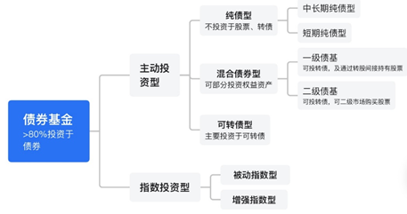
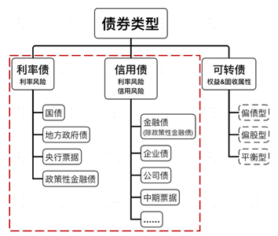

MLF、LPR：中期借贷便利（Medium-term Lending Facility，简称MLF）利率或“市场报价利率”。现在贷款市场报价利率（Loan Prime Rate，简称LPR，英文直译为“贷款基准利率”）主要是由中期借贷便利利率（MLF），加点形成。https://finance.sina.com.cn/zl/china/2022-05-20/zl-imcwipik0899962.shtml#:~:text=%E5%A4%AE%E8%A1%8C%E6%94%BF%E7%AD%96%E5%88%A9%E7%8E%87%EF%BC%8C%E6%98%AF,%E5%B7%A5%E5%85%B7%E5%92%8C%E5%88%A9%E7%8E%87%E6%B0%B4%E5%B9%B3%E3%80%82

沪金主连、黄金9999、黄金T+D、mAu(T+D)： https://xueqiu.com/2770678756/245099175

费雪方程式：货币数量 * 货币流通速度 = 产品价格 * 产品产量 https://mp.weixin.qq.com/s/xk0ebZrf0l4pT-yR839biQ> 

债券

[repo](https://www.investopedia.com/terms/r/repurchaseagreement.asp)

[TRS](https://www.investopedia.com/terms/t/totalreturnswap.asp)

债券期货是利率期货(Interest Rate Futures)的一种，是一种标准化的买卖合约，标的为一定数量的某种利率相关的商品，通常是一个中长期债券。

