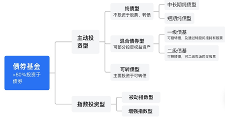
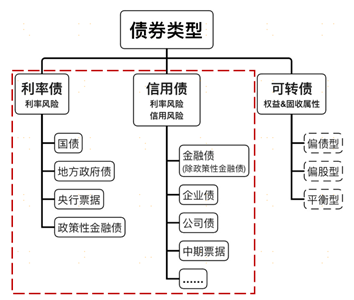
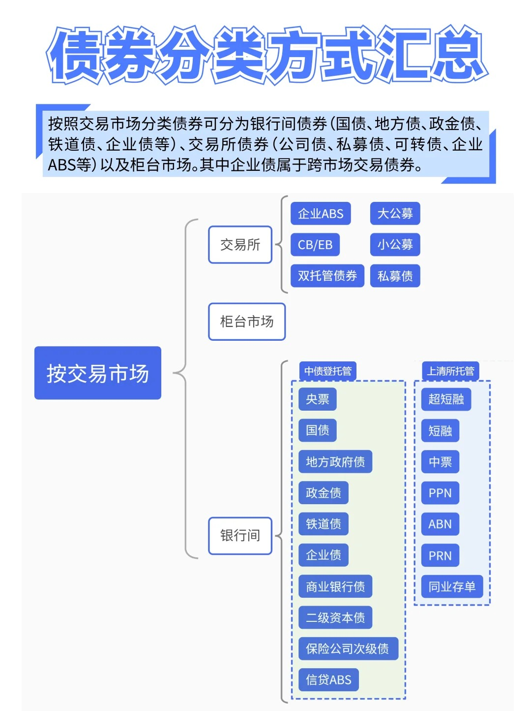
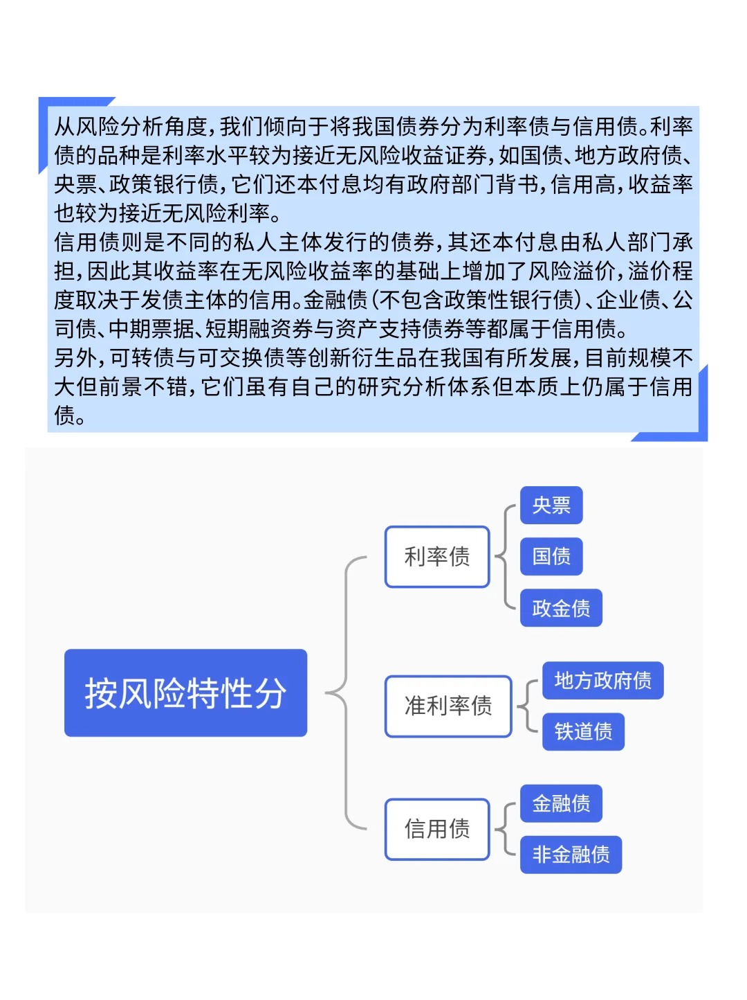
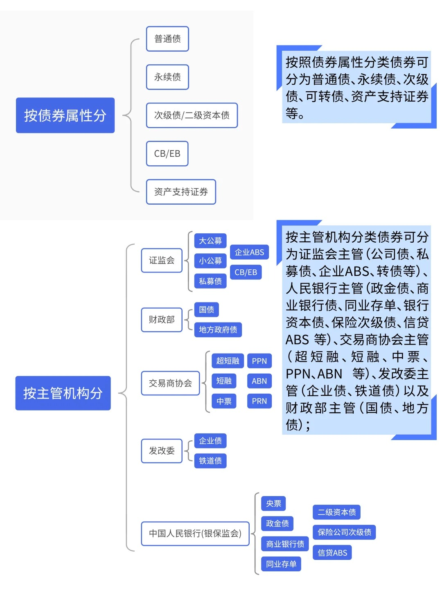
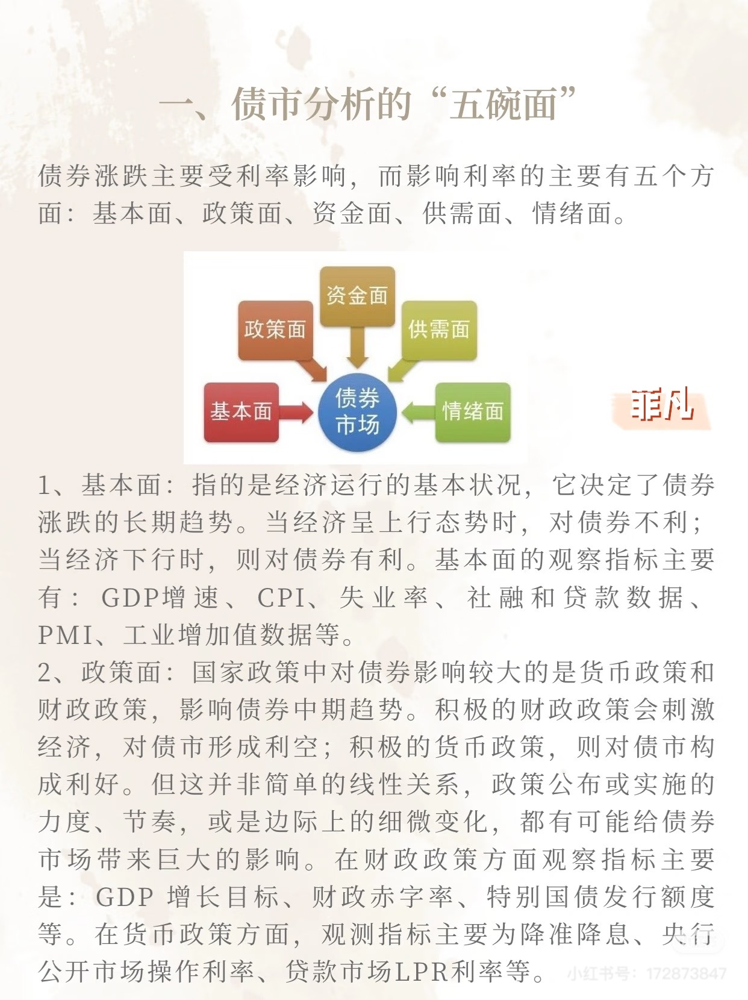
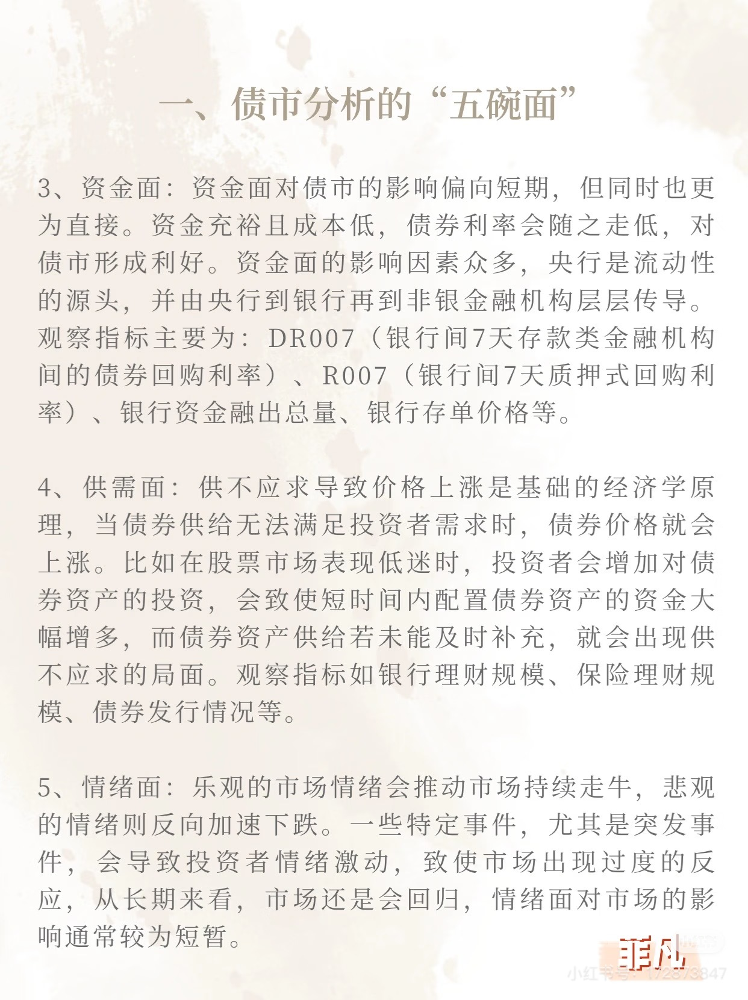

MLF、LPR：中期借贷便利（Medium-term Lending Facility，简称MLF）利率或“市场报价利率”。现在贷款市场报价利率（Loan Prime Rate，简称LPR，英文直译为“贷款基准利率”）主要是由中期借贷便利利率（MLF），加点形成。https://finance.sina.com.cn/zl/china/2022-05-20/zl-imcwipik0899962.shtml#:~:text=%E5%A4%AE%E8%A1%8C%E6%94%BF%E7%AD%96%E5%88%A9%E7%8E%87%EF%BC%8C%E6%98%AF,%E5%B7%A5%E5%85%B7%E5%92%8C%E5%88%A9%E7%8E%87%E6%B0%B4%E5%B9%B3%E3%80%82

沪金主连、黄金9999、黄金T+D、mAu(T+D)： https://xueqiu.com/2770678756/245099175

费雪方程式：货币数量 * 货币流通速度 = 产品价格 * 产品产量 https://mp.weixin.qq.com/s/xk0ebZrf0l4pT-yR839biQ> 

债券

按交易方式划分：

1. 现金债券（现券）

- 指已经发行、在市场上实际交易的债券。
- 可以在二级市场买卖。
- 适用于一级（新发）和二级（转让）市场。

2. 债券远期（Forward）

- 指约定未来某一时间以特定价格买入或卖出某一债券的合约。
- 属于场外市场交易，具有对冲利率风险的功能。

3. 债券回购（Repo）

- 本质上是短期融资方式，以债券为抵押借入资金。
- 分为正回购（融资方）和逆回购（出资方）。

4. 债券期货

- 比如中国国债期货（T-bond Futures）。
- 标的是国债，属于标准化的金融衍生品，用于利率风险对冲或投机。

**(一)债券现券交易、回购交易、远期交易和期货交易的基本概念**

1．**现券交易（即期交易）**

是指证券买卖双方在成交后就办理交收手续，买入者付出资金并得到证券，卖出者交付证券并得到资金，也就是所谓二级市场的债券交易。

2．回购交易

回购交易是指债券买卖双方(资金融入方和资金融出方)在成交的同时，约定于未来某一时间以某一约定价格双方再进行反向交易的行为。

3．远期交易

远期交易是双方约定在未来某一时刻(或时间段内)按照现在确定的价格买卖标的债券的行为。

期货交易

期货交易是**在交易所进行的标准化的远期交易**，即交**易双方在集中性的市场以公开竞价方式所进行的期货合约的交易**。

4.债券借贷

是指债券融入方以一定数量的债券为质物，从债券融出方借入标的债券，同时约定在未来某一日期归还所借入标的债券，并由债券融出方返还相应质物的债券融通行为。

**(三)债券报价的主要方式**

1．**公开报价**

公开报价是指参与者为**表明自身交易意向**而面向市场作出的、**不可直接确认成交的报价**。

2．对话报价

对话报价是指参与者**为达成交易**而直接向交易对手方作出的、**对手方确认即可成交的报价**。

3．双边报价

双边报价是银行间债券市场开展双边报价业务的交易员进行**现券买卖报价时**，在中国人民银行核定的债券买卖差价范围内连续报出该券种的买卖实价，并同时报出该券种的买卖数量、清算速度等交易要素。

4．小额报价

小额报价是在交易系统中，**一次报价、规定交易数量范围**和**对手范围的现券单向撮合交易方式**。

**(五)债券登记、托管、兑付及付息的有关规定**

2．债券托管

投资人均可在

 **中央国债登记结算有限责任公司(中央结算公司)**

 **银行间市场清算所股份有限公司(上海清算所)**

 **中国证券登记结算公司(中国结算公司)**

按实名制原则以自己名义开立债券托管账户。债券托管量等于已经发行但尚未到期的债券总量。

3．债券兑付和付息

债券兑付是偿还本金，债券付息是支付利息。

（1）一般情况下，**债券有五种兑付方式**：

 **到期兑付**

 **提前兑付**

 **债券替换**

 **分期兑付**

 **转换为普通股**兑付。

（2）债券利息的支付方式主要有三种：

 **息票方式(剪息票方式)**

 **折扣利息**

 **本息合一方式**。

链接：https://zhuanlan.zhihu.com/p/163368215

利率债,

信用债,

可转债（Convertible Bonds），

ABS（Asset-Backed Securities，资产支持证券）,

CLO（Collateralized Loan Obligation，贷款抵押债券）,

MBSMortgage-Backed Securities，住房抵押贷款支持证券）,

Reits（Real Estate Investment Trusts，不动产投资信托基金）,

Structured noted（结构化票据）

| 类别             | 底层资产/信用来源      | 主要风险             | 是否标准化   | 典型投资者         |
| ---------------- | ---------------------- | -------------------- | ------------ | ------------------ |
| 利率债           | 国家信用               | 利率风险             | 是           | 银行、保险、基金   |
| 信用债           | 企业信用               | 信用风险、流动性风险 | 是           | 各类机构、散户     |
| ABS              | 多样（消费贷、租赁等） | 资产池违约、早偿     | 半标准化     | 银行、资管、私募   |
| CLO              | 企业杠杆贷款           | 信用、管理人能力     | 结构复杂     | 对冲基金、专业机构 |
| MBS              | 住房/商业地产按揭贷款  | 违约、早偿、房价波动 | 标准化程度高 | 保险、养老金       |
| REITs            | 房地产或抵押贷款       | 房地产周期、利率     | 是（上市）   | 散户、机构均可     |
| Structured Notes | 衍生品+发行人信用      | 市场风险+信用风险    | 定制化       | 高净值、机构       |

| 产品               | 主要场所             | 个人能否参与     | 流动性       |
| ------------------ | -------------------- | ---------------- | ------------ |
| 国债、政金债       | 银行间（主）+ 交易所 | ✅（交易所/柜台） | 高           |
| 公司债             | 交易所               | ✅                | 中           |
| 企业债、中票、短融 | 银行间               | ❌（门槛高）      | 高（机构间） |
| 企业ABS            | 交易所               | ✅（部分）        | 中低         |
| 信贷ABS / MBS      | 银行间               | ❌                | 中           |
| 公募REITs          | 交易所               | ✅                | 中           |
| 可转债             | 交易所               | ✅                | 高           |
| 同业存单           | 银行间               | ❌                | 高（机构）   |
| 结构化票据         | 私募（场外）         | ❌（高净值专属）  | 极低         |

[repo](https://www.investopedia.com/terms/r/repurchaseagreement.asp)

债券期货是利率期货(Interest Rate Futures)的一种，是一种标准化的买卖合约，标的为一定数量的某种利率相关的商品，通常是一个中长期债券。

