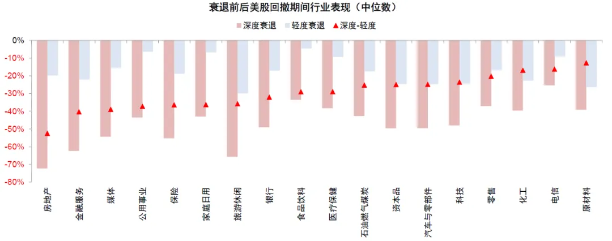

```
美国衰退的判断依据与历史经验
陈刚-CICC
2024
```

**经济衰退（Economic recession）是指经济活动严重、广泛且长期的低迷。**美国关于衰退的阶段划分长期以来由国家经济研究局（National Bureau of Economic Research，NBER）认定，**主要考察的指标包括扣除转移支付后的个人实际收入、非农就业、家庭调查就业、实际个人消费支出、实际制造与贸易销售、以及工业产出。**NBER在认定衰退时，会综合考虑深度（depth）、广度（diffusion）、以及持续时间（duration）。

发现触发因素可大体归结为货币紧缩、财政减支、高杠杆、股市大跌、及外部冲击这五种情形的一种或多种。

**行业表现：**日常消费及防御板块在回撤期间跌幅普遍较小，符合防御板块特征；但房地产、金融服务、媒体、公用事业、保险等板块在深度衰退期间跌幅更为剧烈，意味着此类板块对于衰退程度更加敏感，相比之下成长风格的科技板块敏感度相对较低。



**此外，衰退不同阶段资产表现也有差异：1）初期，**原油最好，黄金及国债其次，美元及工业金属一般，新兴与成长股、信用债落后；上中游周期领先，防御/日常消费其中，金融地产、科技及可选消费不佳；**2）中期，**原油及工业金属回落，债券最好，美股修复；防御/日常消费最好，上中游周期回落，金融地产及科技修复；**3）后期，**美股、新兴及工业金属修复，债券一般，原油落后，黄金最差；金融地产及可选消费最好，上中游周期及科技媒体修复，防御/日常消费最差。

从资产角度，在经济“软着陆”和美联储小幅降息的基本假设下，降息兑现前，分母端（如美债、黄金）资产还是可以做而且弹性更大，分子端风险资产（如美股、铜等）会有压力，这也是每次降息交易的典型“套路

**降息开启前，受益于宽松的降息交易依然可以参与。**受益于降息分母端流动性改善的资产有一定空间且弹性更大，但由于没有其他受益逻辑，需要把握节奏“且战且退”，例如美债、黄金以及缺乏盈利支撑的小盘股；分子端风险资产面临回调压力，但由于不是衰退情形，风险资产不会持续承压，回调也为后续提供了介入机会。

**降息兑现后，降息同时解决分子和分母问题的资产会更好。**降息以后，受益于融资成本下行带来的需求抬升，进而改善分子端盈利的资产，相对配置价值上升。降息兑现时可能也是降息交易的尾声之时，逐步再转向再通胀受益资产，如美股及铜油等大宗资源品。


