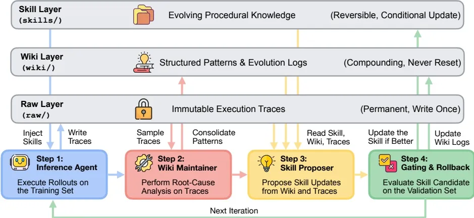

```
When to Use Graphs in RAG
ICLR 2026
```

| 级别 | 任务类型   | 例子                             |
| ---- | ---------- | -------------------------------- |
| L1   | 事实检索   | 圣米歇尔山在法国哪个大区？       |
| L2   | 复杂推理   | 事件A和事件B之间有什么关联？     |
| L3   | 上下文摘要 | 综合多处信息，概括某个角色的作用 |
| L4   | 创造性生成 | 基于事实做改写创作               |

L1考的是"找得到"，L2往上考的是"想得明白"，需要把多个概念之间的关系串起来才行。

第二，评估是分环做的。不是只看最后答案对不对，而是拆成三段：图构建质量（实体关系抽得准不准）、检索质量（上下文相关性和证据召回率）、生成质量（准确率和忠实度）。这样结果不好的时候，能知道是哪一环拖了后腿。

第一条：L1这种简单任务上，GraphRAG经常输给普通RAG。

事实型问题，向量检索捞一段原文基本就能答。GraphRAG还要先认实体、再沿关系爬一圈，爬回来的邻居节点多了，真正相关的证据反而被冲淡了。图在这里带来的不是信息，是噪声。

第二条：L2往上的复杂任务，GraphRAG赢得比较明显。

复杂推理、跨文档摘要这类任务，缺的往往不是某个信息点，而是信息点之间的连线——答案散在好几个文档里，得顺着关系串起来才有答案。关系恰恰是图最擅长表达的东西。

**那到底什么时候该用图谱**

结合论文的结论，可以粗略这么判断：

- 问题需要多跳："X影响了哪些下游""A和B怎么关联上的"，要顺着关系走两步以上，适合图谱
- 数据的价值在关系里：问答绕不开"实体之间怎么连着"，而不是"某个值是多少"，适合图谱
- 需要可追溯：结论要给出明确的关系路径，不能只是"找了几段相似的文本"，适合图谱

反过来，如果场景主要是"从一堆文档里找相似段落回答单点问题"，普通向量RAG就够了，上图谱纯属增加成本。

平面问题走向量，立体问题走图谱

```
WikiSkill: Compiling Agent Experience into Persistent Knowledge for Skill Evolution
- 202608
- google
```



**WikiSkill 核心设计：三层知识架构**

整个工作区分**原始执行经验、沉淀知识、可执行技能**三层，Wiki 层永久保留，技能层可以回滚撤销。

| 层级                   | 目录      | 特性               | 说明                                                         |
| :--------------------- | :-------- | :----------------- | :----------------------------------------------------------- |
| Raw Layer（原始层）    | `raw/`    | 永久、只写不可修改 | 存储 Agent 完整执行轨迹（推理、工具调用、观测、动作），作为事实数据源 |
| Wiki Layer（知识库层） | `wiki/`   | 持续累积，永不重置 | 结构化沉淀成功策略、失败根因；包含 patterns 模式文档、logs.md 演化日志、skill‑impact.md 记录所有技能提案的接受 / 拒绝审计记录；**技能更新可以回滚，但 Wiki 永远不会回滚** |
| Skill Layer（技能层）  | `skills/` | 可回滚、条件更新   | 存放可执行模块化技能（SKILL.md 指令 + PURPOSE.md 溯源文档），推理时注入 Agent 提示词直接使用 |

**迭代演化循环（4 大组件）**

1. **Inference Agent 推理 Agent**：使用当前技能集在训练任务上跑推理，产出原始执行轨迹；**推理阶段不能访问 Wiki 层**（消融证明会损害技能质量）。
2. **Wiki Maintainer 知识库维护器**：采样成功 / 失败轨迹，做根因分析，更新 Wiki：新增 / 修改 patterns 模式、追加演化日志、记录提案结果。
3. **Skill Proposer 技能提案器（ReAct 交互模式）**：读取 Wiki 知识库与原始轨迹，按需查阅文件，生成新技能或者增量补丁修改旧技能，每次只做一处原子修改。
4. **Gating & Rollback 门控与回滚**：把候选技能放到验证集评估；性能提升则保留新技能，性能下降就回滚技能集合；**Wiki 知识库无论是否通过都持续更新，保存全部历史经验**。

算法逻辑：即使技能改动被拒绝，失败的经验、失败提案依然留在 Wiki，后续迭代不会重复生成同样错误方案。


```
code as agent harness
- 2026
- University of Illinois Urbana-Champaign 、Meta 、Stanford Universit
```

在新兴的智能体系统中，代码不再仅仅是输出目标，而越来越多地作为智能体推理、行动、环境建模和基于执行的验证的操作基础。我们通过“智能体驱动框架”这一视角来阐述这种转变，并提出“代码即驱动框架”的统一观点，将代码视为构建智能体基础设施的核心基础。

> 将code level提到这么高不一定真，可以作为相关领域参考


```
ReasoningBank: Enabling agents to learn from experience
- google
- ICLR
- 202604
```

https://research.google/blog/reasoningbank-enabling-agents-to-learn-from-experience/

我们引入了一个新的代理记忆框架（[github](https://github.com/google-research/reasoning-bank)），该框架从成功和失败的经验中提炼出测试时间自我进化的有用见解。在网络浏览和软件工程基准进行评估时，与基线方法相比，ResoningBank提高了代理效率（更高的成功率）和效率（更少的任务步骤）。


```
https://research.google/blog/building-better-ai-benchmarks-how-many-raters-are-enough/
-google
-202603
```

https://research.google/blog/building-better-ai-benchmarks-how-many-raters-are-enough/

把这看作是一个介于*广度*和*深度*之间的问题。广度（即森林）方法要求1000个不同的人每人在餐厅尝试一顿饭，以获得整体质量感。深度（树）方法要求20人尝试相同的50餐，揭示更多关于特定菜肴的信息，这可能会影响整体评级。

从历史上看，人工智能评估一直倾向于森林方法。大多數研究人員滿足於每個專案1到5個評分者，假設這足以找到一個「正確」的真理。我们的研究表明，该标准通常不足以捕捉自然的分歧，我们为构建更可靠和更具成本效益的人工智能基准提供了路线图。
